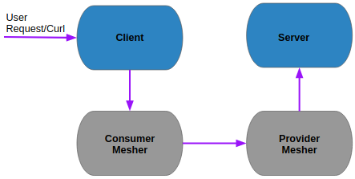

# PHP-Mesher-Example
   

 1) using dockercompose build the container image of php server and php client and start the the container along with mesher
  
     docker-compose up
 2) To verify the php client and php server communication
 
       curl request http://[ipaddress of the client]:8888/client.php
       ```
       curl http://127.0.0.1:8888/client.php

       OUTPUT:
       10
       ```

## Diagram


      
